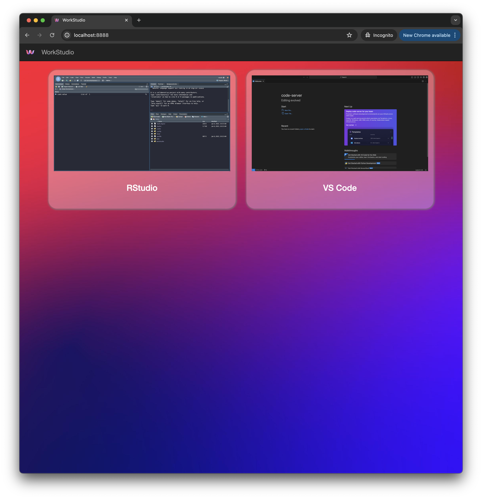

# WorkStudio <a href="github.com/gacolitti/workstudio"></a>

<!-- badges: start -->
[](https://github.com/gacolitti/workstudio)
<!-- badges: end -->

## Introduction

WorkStudio is a containerized development environment built on
ShinyProxy, designed to support both RStudio and VS Code IDEs. The goal
of WorkStudio is to provide a seamless, flexible, and powerful
environment for data analysis and software development. With WorkStudio,
you can run multiple instances of both IDEs directly in your browser,
whether on a server or locally.

[](https://www.youtube.com/watch?v=KXwxoSq4kH4)

## Key Features

- **Multiple Instances:** Run multiple instances of RStudio and VS Code
  in your browser.
- **Persistent Work Environment:** Docker containers are configured to
  never expire, ensuring your work is always saved right where you left
  off.
- **Preinstalled R Packages:** Commonly used R packages come
  preinstalled, saving you setup time.
- **Customizable Preferences:** User preferences are set and easily
  customizable to fit your workflow.
- **Docker Volumes:** Work is persisted in Docker volumes, ensuring data
  integrity and easy access.
- **Flexible Deployment:** Can be deployed both locally and on a server
  for greater flexibility.
- **SSH Keys:** SSH keys are created in the docker image so you just
  need to copy and paste the public key into GitHub to start cloning
  your repos.

## Project Structure

    workstudio/
    │
    ├── Dockerfile             # Dockerfile for building the ShinyProxy environment
    ├── rstudio/               # RStudio server configuration directory
    ├── templates/             # Templates and logos used by ShinyProxy
    ├── docker-compose.yml     # Docker Compose configuration 
    ├── application.yml        # Application configuration file for ShinyProxy
    ├── vscode/                # VS Code configuration directory
    ├── clean-run.sh           # Shell script for running the project from a clean slate

## Getting Started

### Prerequisites

- Docker
- Docker Compose

### Installation

1.  **Clone the repository:**

    ``` sh
    git clone https://github.com/gacolitti/workstudio.git
    cd workstudio
    ```

2.  **Build the Docker images:**

    ``` sh
    docker-compose build
    ```

3.  **Start the containers:**

    ``` sh
    docker-compose up
    ```

### Usage

#### Accessing Workstudio

- Open your browser and navigate to `http://localhost:8888`.

### Configuration Details

#### Dockerfile

The main Dockerfile is set up to create a ShinyProxy environment:

``` dockerfile
FROM openjdk:17-jdk-slim
LABEL product=shinyproxy

ARG SHINYPROXY_VERSION=3.1.1

RUN apt-get update && apt-get install -y wget && apt-get clean

RUN wget -P /opt/shinyproxy https://www.shinyproxy.io/downloads/shinyproxy-${SHINYPROXY_VERSION}.jar     && mv /opt/shinyproxy/shinyproxy-${SHINYPROXY_VERSION}.jar /opt/shinyproxy/shinyproxy.jar

RUN chmod +x /opt/shinyproxy/shinyproxy.jar
WORKDIR /opt/shinyproxy/
CMD ["java", "-jar", "shinyproxy.jar"]
```

#### docker-compose.yml

The Docker Compose configuration sets up services for ShinyProxy,
RStudio, and VS Code:

``` yaml
services:
  shinyproxy:
    container_name: shinyproxy
    build:
      context: .
      dockerfile: Dockerfile
    volumes:
      - '/var/run/docker.sock:/var/run/docker.sock'
      - "./application.yml:/opt/shinyproxy/application.yml:z"
      - "./templates:/opt/shinyproxy/templates"
    networks: 
      - workstudio-net
    ports:
      - 8888:8080
  rstudio:
    container_name: rstudio
    build:
      context: rstudio
      dockerfile: Dockerfile
  vscode:
    container_name: vscode
    build:
      context: vscode
      dockerfile: Dockerfile

networks: 
  workstudio-net:
    name: "workstudio-net"
```

#### application.yml

The application.yml file configures ShinyProxy to manage multiple
instances of RStudio and VS Code and necessary docker volumes for
persistent storage:

``` yaml
proxy:
  title: "WorkStudio"
  port: 8080
  default-max-instances: 10
  stop-proxies-on-shutdown: true
  recover-running-proxies: true
  recover-running-proxies-from-different-config: true
  authentication: none
  template-path: ./templates/2col
  logo-url: file:///opt/shinyproxy/templates/workstudio-logo.png
  favicon-path: /opt/shinyproxy/templates/workstudio-logo.png # not working
  docker:
      internal-networking: true
  specs:
  - id: rstudio
    display-name: RStudio
    logo-url: /assets/img/rstudio.png
    favicon-path: /opt/shinyproxy/templates/rstudio-logo.png
    container-image: workstudio-rstudio
    container-volumes:
      - "workstudio_rstudio:/home/rstudio/workstudio"
      - "workstudio_r_libraries:/usr/local/lib/R/site-library"
      - "workstudio_renv_cache:/home/rstudio/renv/cache"
    container-env:
      DISABLE_AUTH: true
      WWW_ROOT_PATH: "#{proxy.getRuntimeValue('SHINYPROXY_PUBLIC_PATH')}"
    port: 8787
    container-network: "workstudio-net"
    heartbeat-timeout: -1
    stop-on-logout: false
    max-lifetime: -1
  - id: vscode
    display-name: VS Code
    logo-url: /assets/img/vscode.png
    favicon-path: /opt/shinyproxy/templates/vscode-logo.png
    container-image: workstudio-vscode
    container-volumes:
      - "workstudio_vscode:/home/vscode/workstudio"
      - "workstudio_vscode_settings:/root/.local/share/code-server/User"
      - "workstudio_r_libraries:/usr/local/lib/R/site-library"
      - "workstudio_renv_cache:/home/vscode/renv/cache"
    container-env:
      DISABLE_AUTH: true
      WWW_ROOT_PATH: "#{proxy.getRuntimeValue('SHINYPROXY_PUBLIC_PATH')}"
    port: 8090
    container-network: "workstudio-net"
    heartbeat-timeout: -1
    stop-on-logout: false
    max-lifetime: -1
```

## Contributing

Contributions are welcome! Please fork the repository and create a pull
request with your changes.

## License

This project is licensed under the MIT License. See the LICENSE file for
more details.
